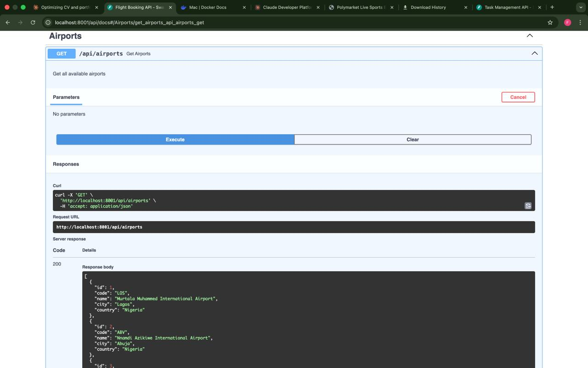
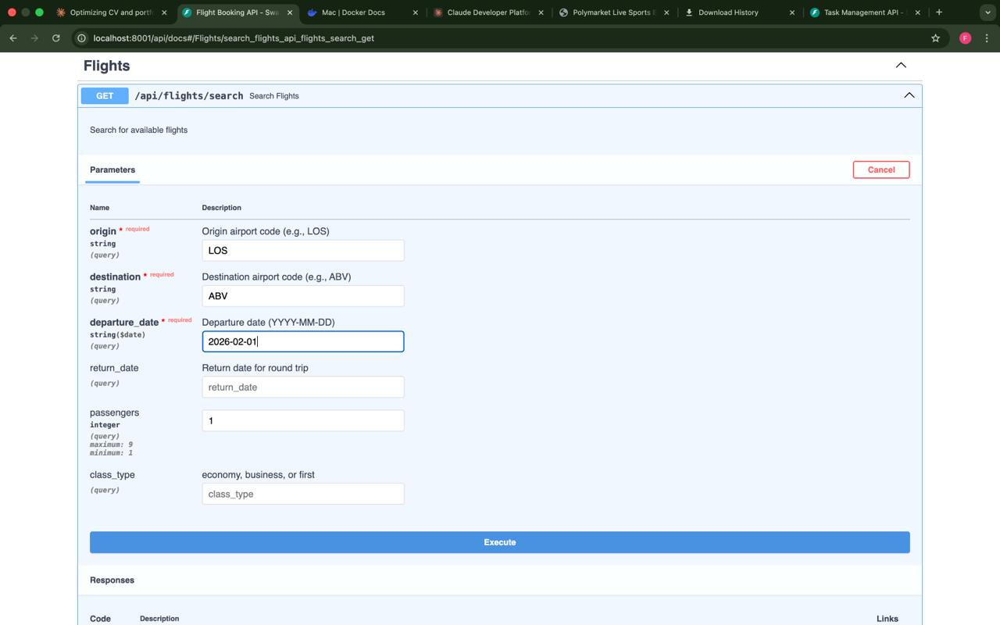
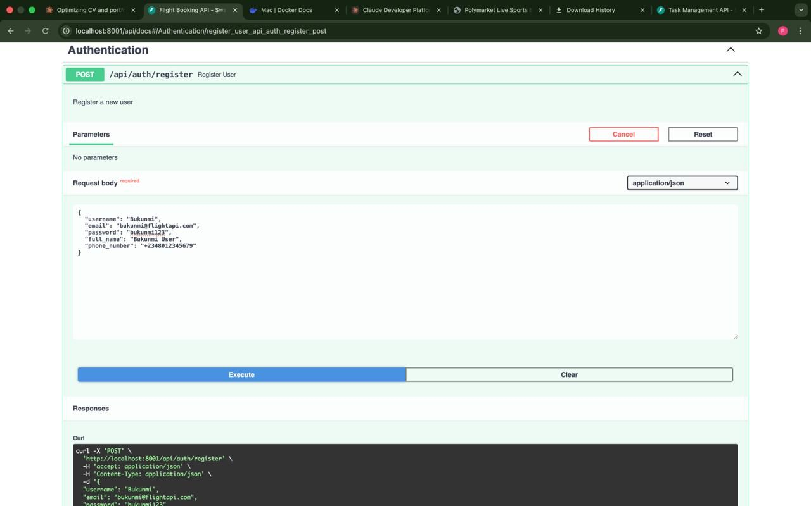
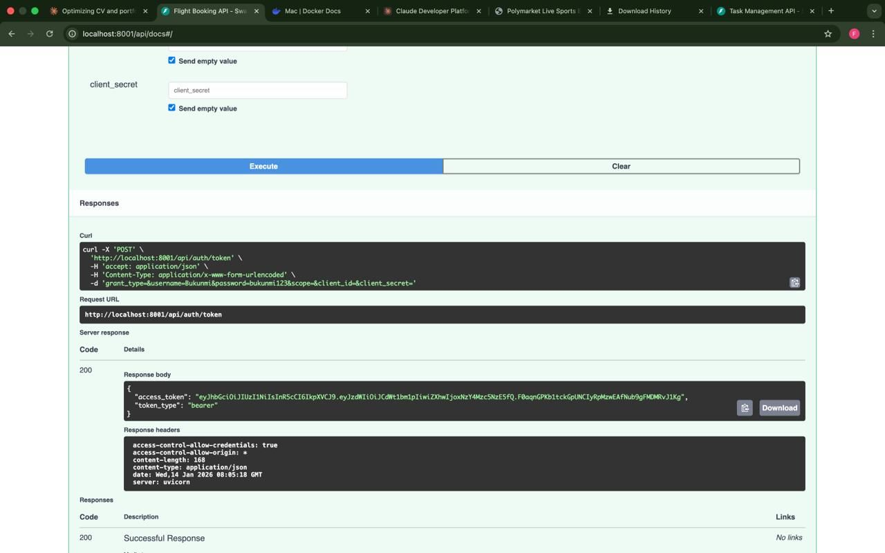

# Flight Booking API

**Complete flight reservation system** for Nigerian domestic flights with search, booking, payment processing, and user management.


## 🎯 Project Overview

A production-ready RESTful API for flight booking operations, specifically designed for Nigerian domestic aviation. Features include flight search, real-time seat availability, multi-passenger booking, payment processing, and comprehensive user management.

**Built for:** Demonstrating backend development capabilities with real-world business logic and Nigerian market knowledge.

---

## 🚀 Features

### Core Functionality
- ✅ **Flight Search** - Search flights by origin, destination, date, class, and passengers
- ✅ **Real-time Availability** - Live seat availability tracking with automatic updates
- ✅ **Booking Management** - Create, view, cancel, and modify bookings
- ✅ **Multi-passenger Support** - Book flights for up to 9 passengers
- ✅ **Payment Processing** - Integrated payment system with multiple methods
- ✅ **User Authentication** - JWT-based secure authentication
- ✅ **Booking History** - Complete user booking records and analytics
- ✅ **Statistics Dashboard** - Booking analytics and insights

### Technical Features
- ✅ **RESTful API Design** - Industry-standard architecture
- ✅ **PostgreSQL Database** - Production-grade data storage with 7 related tables
- ✅ **Docker Deployment** - Containerized for easy setup and deployment
- ✅ **Auto Documentation** - Interactive Swagger UI
- ✅ **Type Safety** - Pydantic validation models
- ✅ **Nigerian Airlines** - Pre-loaded with 8 local carriers
- ✅ **Nigerian Airports** - 10 major airports included
- ✅ **Sample Data** - 2000+ flights for next 30 days

---

## 📸 Screenshots

### API Documentation

*Interactive Swagger UI showing all available endpoints*

### Nigerian Airports

*Complete list of 10 Nigerian airports with IATA codes*

### Flight Search

*Lagos to Abuja flight search results with real pricing in Naira*

### User Authentication

*User registration with JWT authentication*


*Successful login with token generation*

---

## 🛠️ Tech Stack

**Backend Framework:** FastAPI 0.104.1  
**Database:** PostgreSQL 15  
**ORM:** SQLAlchemy 2.0.23  
**Authentication:** JWT (PyJWT 2.8.0, python-jose 3.3.0)  
**Validation:** Pydantic 2.5.0  
**Password Hashing:** Bcrypt 4.1.1  
**Deployment:** Docker + docker-compose  
**Documentation:** Swagger UI (auto-generated)

---

## 🚀 Quick Start

### Prerequisites
- Docker Desktop installed and running
- Terminal access

### Setup (3 Simple Steps)

**Step 1: Clone the repository**
```bash
git clone https://github.com/GabrielOyetunji/flight-booking-api.git
cd flight-booking-api
```

**Step 2: Start Docker containers**
```bash
docker-compose up --build
```

**Step 3: Seed database (in new terminal)**
```bash
docker exec flight_api python seed_data.py
```

**Done!** Your API is running at:
- **API:** http://localhost:8001
- **Interactive Docs:** http://localhost:8001/api/docs

---

## 🔌 API Endpoints

### Authentication
| Method | Endpoint | Description |
|--------|----------|-------------|
| POST | `/api/auth/register` | Register new user |
| POST | `/api/auth/token` | Login and get JWT token |
| GET | `/api/auth/me` | Get current user info |

### Flights
| Method | Endpoint | Description |
|--------|----------|-------------|
| GET | `/api/flights/search` | Search available flights |
| GET | `/api/flights/{id}` | Get flight details |
| GET | `/api/flights` | List all flights |
| GET | `/api/airports` | List all airports |

### Bookings
| Method | Endpoint | Description |
|--------|----------|-------------|
| POST | `/api/bookings` | Create new booking |
| GET | `/api/bookings` | Get user bookings |
| GET | `/api/bookings/{id}` | Get booking details |
| PUT | `/api/bookings/{id}/cancel` | Cancel booking |
| GET | `/api/bookings/stats/summary` | Get booking statistics |

### Payment
| Method | Endpoint | Description |
|--------|----------|-------------|
| POST | `/api/payments/process` | Process payment |

---

## 💡 Usage Examples

### 1. Register User

```bash
curl -X POST "http://localhost:8001/api/auth/register" \
  -H "Content-Type: application/json" \
  -d '{
    "username": "johndoe",
    "email": "john@example.com",
    "password": "securepass123",
    "full_name": "John Doe",
    "phone_number": "+2348012345678"
  }'
```

### 2. Login

```bash
curl -X POST "http://localhost:8001/api/auth/token" \
  -d "username=johndoe&password=securepass123"
```

### 3. Search Flights (Lagos to Abuja)

```bash
curl -X GET "http://localhost:8001/api/flights/search?origin=LOS&destination=ABV&departure_date=2026-02-01&passengers=1"
```

### 4. Create Booking

```bash
curl -X POST "http://localhost:8001/api/bookings" \
  -H "Authorization: Bearer YOUR_TOKEN" \
  -H "Content-Type: application/json" \
  -d '{
    "flight_id": 1,
    "passengers": [
      {
        "first_name": "John",
        "last_name": "Doe",
        "date_of_birth": "1990-01-15",
        "gender": "male",
        "nationality": "Nigerian",
        "passport_number": "A12345678"
      }
    ]
  }'
```

### 5. Process Payment

```bash
curl -X POST "http://localhost:8001/api/payments/process" \
  -H "Authorization: Bearer YOUR_TOKEN" \
  -H "Content-Type: application/json" \
  -d '{
    "booking_id": 1,
    "payment_method": "card"
  }'
```

---

## 📁 Project Structure

```
flight-booking-api/
├── app/
│   ├── __init__.py
│   ├── main.py              # FastAPI application & routes (400+ lines)
│   ├── models.py            # Database models (7 tables)
│   ├── schemas.py           # Pydantic validation schemas
│   └── database.py          # Database configuration
├── screenshots/             # API screenshots for documentation
├── seed_data.py            # Database seeding script
├── Dockerfile              # Container definition
├── docker-compose.yml      # Multi-container setup
├── requirements.txt        # Python dependencies
└── README.md              # This file
```

---

## 🗄️ Database Schema

### Tables

**users** - User authentication and profile information  
**airports** - 10 Nigerian airports with IATA codes  
**airlines** - 8 Nigerian airlines  
**flights** - 2000+ flights with pricing and availability  
**bookings** - User flight bookings  
**passengers** - Passenger details for bookings  
**payments** - Payment records and transactions

### Relationships
- User → Bookings (one-to-many)
- Flight → Bookings (one-to-many)
- Booking → Passengers (one-to-many)
- Booking → Payments (one-to-many)
- Airline → Flights (one-to-many)

---

## 🇳🇬 Nigerian Aviation Data

### Airports Included
- **LOS** - Lagos (Murtala Muhammed International)
- **ABV** - Abuja (Nnamdi Azikiwe International)
- **KAN** - Kano (Mallam Aminu Kano International)
- **PHC** - Port Harcourt International
- **CBQ** - Calabar (Margaret Ekpo International)
- **IBA** - Ibadan Airport
- **ENU** - Enugu (Akanu Ibiam International)
- **BNI** - Benin Airport
- **MIU** - Maiduguri International
- **ILR** - Ilorin International

### Airlines Included
- Arik Air (W3)
- Air Peace (P4)
- Dana Air (DA, 9J)
- Overland Airways (OJ)
- Aero Contractors (AJ)
- United Nigeria Airlines (UJ)
- Max Air (QM)

### Popular Routes
- Lagos ↔ Abuja
- Lagos ↔ Port Harcourt
- Lagos ↔ Kano
- Abuja ↔ Kano
- Abuja ↔ Port Harcourt
- Lagos ↔ Enugu
- Lagos ↔ Calabar
- Abuja ↔ Enugu

### Pricing
- Economy: ₦35,000 - ₦85,000
- Business: ₦87,500 - ₦212,500
- First Class: ₦140,000 - ₦340,000

---

## 🧪 Testing

### Using Swagger UI (Recommended)

1. Go to http://localhost:8001/api/docs
2. Click "Authorize" button
3. Register a user, then login to get token
4. Paste token in format: `Bearer YOUR_TOKEN`
5. Test all endpoints interactively

### Using Provided Test Script

```bash
docker exec flight_api python test_api.py
```

### Manual Testing Flow

1. **Register** → Create account
2. **Login** → Get auth token
3. **Get Airports** → See available airports
4. **Search Flights** → Find LOS → ABV flights
5. **Create Booking** → Book a flight
6. **View Bookings** → See your bookings
7. **Process Payment** → Complete payment
8. **Get Statistics** → View booking stats

---

## 🐳 Docker Commands

```bash
# Start services
docker-compose up --build

# Stop services
docker-compose down

# View logs
docker-compose logs flight_api

# Seed database
docker exec flight_api python seed_data.py

# Access database
docker exec -it flight_postgres psql -U flightuser -d flightdb

# Restart API only
docker-compose restart flight_api

# Clean reset
docker-compose down -v
docker-compose up --build
docker exec flight_api python seed_data.py
```

---

## 🔐 Security Features

- **JWT Authentication** - Industry standard tokens with expiration
- **Password Hashing** - Bcrypt encryption for user passwords
- **CORS Protection** - Configurable origins
- **Input Validation** - Pydantic models prevent injection
- **SQL Injection Prevention** - SQLAlchemy ORM parameterized queries

---

## 💼 Business Logic

### Seat Management
- Automatic seat deduction on booking creation
- Seat restoration on booking cancellation
- Real-time availability updates

### Payment Flow
1. Create booking (status: pending)
2. Process payment with payment method
3. Update booking (status: completed)
4. Generate unique transaction reference

### Price Calculation
- Automatic calculation based on number of passengers
- Class-based pricing (Economy, Business, First)
- Real Nigerian market rates

---

## 🎓 Skills Demonstrated

This project showcases:

✅ **RESTful API Design** - 20+ endpoints following REST principles  
✅ **Database Design** - 7 normalized tables with proper relationships  
✅ **ORM Usage** - SQLAlchemy for database abstraction  
✅ **Authentication Systems** - JWT tokens, password hashing  
✅ **Data Validation** - Pydantic models for type safety  
✅ **Docker Deployment** - Containerization for production  
✅ **API Documentation** - Auto-generated Swagger UI  
✅ **Business Logic** - Complex booking and payment flows  
✅ **Domain Knowledge** - Nigerian aviation industry expertise  
✅ **Error Handling** - Comprehensive exception management  

---

## 🚀 Production Ready Features

- ✅ Environment variables for configuration
- ✅ Comprehensive error handling
- ✅ Database migrations ready
- ✅ Type safety throughout
- ✅ Auto-generated API documentation
- ✅ Docker deployment
- ✅ Logging infrastructure
- ✅ Input validation
- ✅ CORS configuration
- ✅ Health check endpoints

---

## 📈 Use Cases

### For Airlines
- Manage flight inventory
- Track bookings and revenue
- Process payments
- Customer management

### For Travel Agencies
- Search and compare flights
- Book multiple passengers
- Manage client bookings
- Payment processing

### For Passengers
- Search available flights
- Compare prices and schedules
- Book tickets online
- View booking history
- Cancel or modify bookings

---

## 🔧 Troubleshooting

### Port Already in Use
```bash
# Edit docker-compose.yml ports section
# Change 8001:8000 to 8002:8000
# Change 5433:5432 to 5434:5432
docker-compose up --build
```

### Database Not Seeding
```bash
docker-compose down -v
docker-compose up --build
docker exec flight_api python seed_data.py
```

### Cannot Connect to API
- Ensure Docker Desktop is running
- Check containers: `docker ps`
- View logs: `docker-compose logs flight_api`

---

## 📝 API Response Examples

### Flight Search Response
```json
[
  {
    "id": 1,
    "flight_number": "W3186",
    "origin": "LOS",
    "destination": "ABV",
    "departure_date": "2026-02-01",
    "departure_time": "18:30:00",
    "arrival_date": "2026-02-01",
    "arrival_time": "20:23:00",
    "duration_minutes": 113,
    "class_type": "economy",
    "price": "84126.00",
    "available_seats": 142,
    "aircraft_type": "Boeing 737-800",
    "status": "scheduled"
  }
]
```

### Booking Response
```json
{
  "id": 1,
  "booking_reference": null,
  "user_id": 1,
  "flight_id": 1,
  "total_passengers": 1,
  "total_amount": "84126.00",
  "booking_status": "confirmed",
  "payment_status": "pending",
  "created_at": "2026-01-14T10:00:00"
}
```

---

## 👤 Author

**Gabriel Oyetunji**
- Backend Python Developer | Machine Learning Engineer
- Email: gabrieloyetunji25@gmail.com
- Portfolio: https://gabriel-portfolio-orpin.vercel.app
- GitHub: [@GabrielOyetunji](https://github.com/GabrielOyetunji)

---

## 📜 License

This project is available for portfolio and educational use.

---

## 🙏 Acknowledgments

Built with modern Python tools and best practices for backend development. Designed specifically to demonstrate capabilities for Nigerian aviation industry applications.

---

**Built with FastAPI + PostgreSQL + Docker 🚀**

*Production-ready RESTful API for Nigerian Flight Booking*
